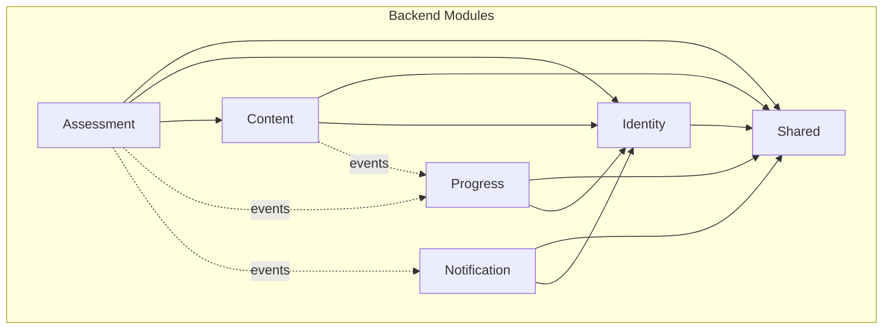

# Diagrams

## Purpose

This directory contains architectural diagrams for the Scholara platform. Diagrams provide visual documentation of system structure, data flow, and component relationships.

---

## Required Diagrams

The following diagrams must be created and maintained:

### 1. System Context Diagram

**File**: `system-context.png` (or `.svg`)

**Purpose**: Shows Scholara in relation to external systems and users

**Should Include**:
- Scholara system boundary
- User types (Student, Teacher, Admin)
- External systems (Email service, etc.)
- High-level data flows

**Format**: C4 Model - Level 1

---

### 2. Modulith Architecture Diagram

**File**: `modulith-architecture.png` (or `.svg`)

**Purpose**: Shows internal module structure and dependencies

**Should Include**:
- All six modules (identity, content, assessment, progress, notification, shared)
- Dependency arrows between modules
- Event flow indicators
- Database relationships

**Format**: C4 Model - Level 2 (Container)

---

### 3. Domain Model Diagram

**File**: `domain-model.png` (or `.svg`)

**Purpose**: Shows core entities and their relationships

**Should Include**:
- All aggregate roots
- Entity relationships (1:1, 1:N, N:M)
- Key attributes
- Module ownership colors

**Format**: UML Class Diagram (simplified)

---

### 4. Exam Flow Sequence Diagram

**File**: `exam-flow-sequence.png` (or `.svg`)

**Purpose**: Shows the complete exam submission and grading flow

**Should Include**:
- Student initiates exam
- Question retrieval
- Answer submission
- Concurrent submission handling
- Grading process
- Event publication
- Notification trigger

**Format**: UML Sequence Diagram

---

### 5. Architecture Evolution Diagram

**File**: `architecture-evolution.png` (or `.svg`)

**Purpose**: Shows planned evolution from modulith to microservices

**Should Include**:
- Phase 1: Modular Monolith (current)
- Phase 2: Extracted Notification Service
- Phase 3: Extracted Assessment Service
- Phase 4: Full Microservices (potential)

**Format**: Timeline or state diagram

---

## Diagram Guidelines

### File Formats

- **Source files**: Use tools that support version control (PlantUML, Mermaid, Draw.io XML)
- **Export files**: PNG or SVG for documentation embedding

### Naming Convention

```
<diagram-name>.<format>
<diagram-name>.source.<tool-extension>
```

Examples:
- `system-context.png`
- `system-context.source.puml`

### Tools Recommended

| Tool       | Best For                    | Format      |
|------------|----------------------------|-------------|
| PlantUML   | Sequence, class diagrams   | `.puml`     |
| Mermaid    | Simple diagrams in Markdown| `.md`       |
| Draw.io    | Complex architecture       | `.drawio`   |
| Structurizr| C4 Model diagrams          | DSL         |

### Version Control

- Commit source files, not just images
- Update diagrams when architecture changes
- Include diagram updates in relevant PRs

---

## Diagram Templates

### PlantUML System Context

```plantuml
@startuml system-context
!include https://raw.githubusercontent.com/plantuml-stdlib/C4-PlantUML/master/C4_Context.puml

Person(student, "Student", "Accesses courses and takes exams")
Person(teacher, "Teacher", "Creates content and grades exams")
Person(admin, "Admin", "Manages system configuration")

System(scholara, "Scholara", "Education and Assessment Platform")

System_Ext(email, "Email System", "Sends notifications")

Rel(student, scholara, "Uses")
Rel(teacher, scholara, "Uses")
Rel(admin, scholara, "Manages")
Rel(scholara, email, "Sends emails via")

@enduml
```

### Mermaid Module Diagram



---

## Related Documents

- [System Overview](../architecture/system-overview.md)
- [Modulith Boundaries](../architecture/modulith-boundaries.md)
- [Domain Model](../architecture/domain-model.md)
